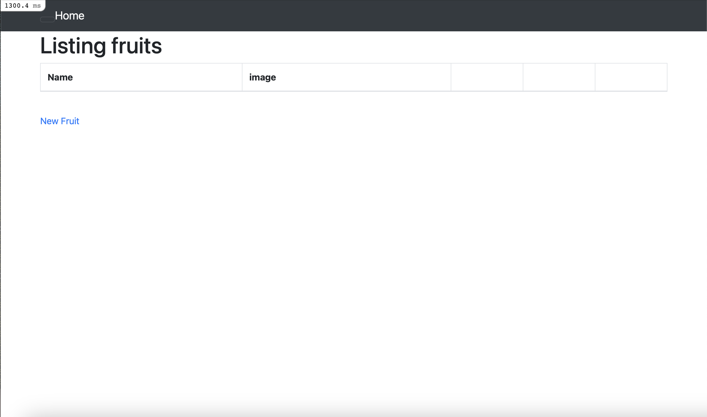
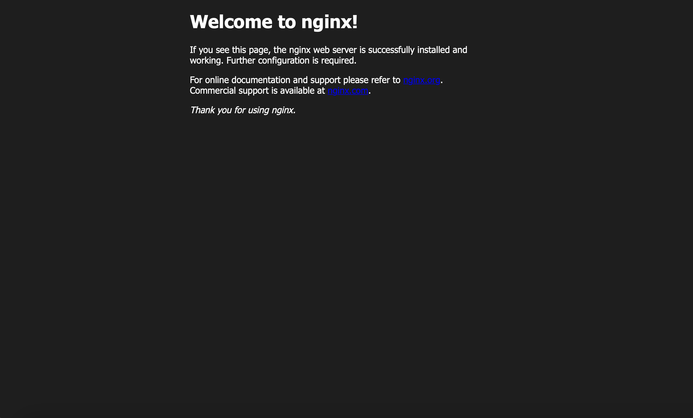

# 組み込みサーバーでのサンプルアプリケーションの動作確認

## 実行環境構築

EC2へ接続

### rbenvとruby-buildをインストール

パッケージをアップロード  

```
sudo yum update -y
```

必要なパッケージをインストール  

```
sudo yum -y install gcc-c++ make patch git curl zlib-devel openssl-devel ImageMagick-devel readline-devel libcurl-devel libffi-devel libicu-devel libxml2-devel libxslt-devel
```  

rbenvをインストール 

```  
git clone https://github.com/sstephenson/rbenv.git ~/.rbenv  
```

PATHを通す  

```
echo 'export PATH="$HOME/.rbenv/bin:$PATH"' >> ~/.bash_profile  
echo 'eval "$(rbenv init -)"' >> ~/.bash_profile  
source .bash_profile  
```

ruby-buildをインストール

```
git clone https://github.com/sstephenson/ruby-build.git ~/.rbenv/plugins/ruby-build
```

### rubyバージョン3.1.2をインストール

```
rbenv install 3.1.2
```

インストールしたrubyを使用可能にするコマンドを実行  

```
rbenv rehash  
rbenv global 3.1.2
```

バージョンを確認  

```
ruby -v
```

### Bundler2.3.14インストール

```
gem install bundler -v 2.3.14
```

### Rails 7.0.4インストール

```
gem install rails -v 7.0.4
```

### Node 17.9.1インストール

```
curl -o- https://raw.githubusercontent.com/nvm-sh/nvm/v0.39.5/install.sh | bash  
source ~/.bash_profile  
nvm install v17.9.1  
```

バージョン確認　　

```
node -v
```

### yarn インストール　

```
npm install --global yarn
```

## サンプルアプリケーションをクローン

```
git clone https://github.com/yuta-ushijima/raisetech-live8-sample-app.git
```

```
cd raisetech-live8-sample-app/
```

## MySQLインストール

```
curl -fsSL https://raw.githubusercontent.com/MasatoshiMizumoto/raisetech_documents/main/aws/scripts/mysql_amazon_linux_2.sh | sh
```

### datebase.ymlを作成

```
cp config/database.yml.sample config/database.yml
```

### database.ymlを編集

```
vim config/database.yml
```

『default』の欄に追記
RDSのusername,PWを記入
『＆host』を作成し、エンドポイントを記入

```
bin/setup
#bundleインストールするよう指示される
bundle update
```
インバウンドルールにポート番号3000を追加　　

```
bin/setup
bin/dev
```

## 組み込みサーバーで起動確認

http://パブリック IPv4 アドレス:3000でアクセス  




# Nginx・unicornで起動

## Nginx設定

### Nginxインストール

```
sudo amazon-linux-extras install nginx1
Is this ok [y/d/N]: y
```

インストール確認

```
yum list installed | grep nginx
```

### Nginx起動と確認

```
sudo systemctl start nginx
#確認
systemctl status nginx
```


### EC2のインバウンドルールに80ポート追加

```
cat /etc/nginx/nginx.conf
```
http://パブリック IPv4 アドレス/でアクセス




### Nginxの設定ファイル編集

```
# 見返したい時用に念の為バックアップとっておく
sudo cp -a /etc/nginx/nginx.conf /etc/nginx/nginx.conf.back
# ファイルの編集　
sudo vim /etc/nginx/nginx.conf
```

```
# For more information on configuration, see:
#   * Official English Documentation: http://nginx.org/en/docs/
#   * Official Russian Documentation: http://nginx.org/ru/docs/

user ec2-user;
worker_processes auto;
error_log /var/log/nginx/error.log;
pid /run/nginx.pid;

# Load dynamic modules. See /usr/share/doc/nginx/README.dynamic.
include /usr/share/nginx/modules/*.conf;

events {
    worker_connections 1024;
}

http {
    log_format  main  '$remote_addr - $remote_user [$time_local] "$request" '
                      '$status $body_bytes_sent "$http_referer" '
                      '"$http_user_agent" "$http_x_forwarded_for"';

    access_log  /var/log/nginx/access.log  main;

    sendfile            on;
    tcp_nopush          on;
    tcp_nodelay         on;
    keepalive_timeout   65;
    types_hash_max_size 4096;

    include             /etc/nginx/mime.types;
    default_type        application/octet-stream;

    # Load modular configuration files from the /etc/nginx/conf.d directory.
    # See http://nginx.org/en/docs/ngx_core_module.html#include
    # for more information.
    include /etc/nginx/conf.d/*.conf;

    upstream unicorn {
    server unix:/home/ec2-user/raisetech-live8-sample-app/unicorn.sock;
    }
    server {
        listen       80;
        listen       [::]:80;
        server_name  ec2-xx-xx-xxx-xxx.ap-northeast-1.compute.amazonaws.com;
        root         /usr/share/nginx/html;

        # Load configuration files for the default server block.
        include /etc/nginx/default.d/*.conf;

        error_page 404 /404.html;
        location = /404.html {
        }

        error_page 500 502 503 504 /50x.html;
        location = /50x.html {
	}
	
	location @unicorn {
	proxy_set_header X-Real-IP $remote_addr;
        proxy_set_header X-Forwarded-For $proxy_add_x_forwarded_for;
        proxy_set_header Host $http_host;
        proxy_pass http://unicorn;
        }
}
}
```

EC2-userにNginx実行権限付与

```
$ cd /var/lib
$ sudo chmod -R 775 nginx
```

EC2を開いた時に、自動で起動するように設定

```
sudo systemctl enable nginx
```

読み込み直す

```
ターミナル（EC2内で実行）
[ec2-user@ip-xx-xx-xx-xx lib]$ cd ~
ターミナル（EC2内で実行）
[ec2-user@ip-xx-xx-xx-xx ~]$ sudo systemctl reload nginx
```

起動時、エラーになる時は、Nginxテキスト構文チェック
```
sudo nginx -t
```

### unicornの起動

```
cd raisetech-live8-sample-app
vim Gemfile
```

```
group:development do  
  gem 'unicorn'
end
```

```
bundle install 
```

```
#移動
[ec2-user@ip-xx-xx-xx-xx ~]$ cd raisetech-live8-sample-app/
#起動
bundle exec unicorn_rails -c config/unicorn.rb -E development -D
#確認
ps -ef | grep unicorn | grep -v grep
```


# ALBを追加

* ターゲットグループ作成  


* セキュリティグループ作成  


* ロードバランサー作成  


* リスナーとルール  


* ネットワークマッピング  


* セキュリティ  


development.rbに追記
```
cd raisetech-live8-sample-app/config/environments
vim development.rb
```
最終行に追加
```
config.hosts << DNS名

```

## Nginxとunicornを再起動
```
ps -ef | grep unicorn | grep -v grep
#masterの番号をkillする
kill -9　xxxx
#停止確認
ps -ef | grep unicorn | grep -v grep
#表示なしなら成功
```
unicorn起動  

DNS名でアクセス  


CSSが反映されていない時は
config/environments/development.rb
config.assets.debug = trueからconfig.assets.debug = falseに変更

## S3バケット作成

IAMロール作成し、S3へのアクセスをEC2に割り当てる

config/storage.ymlの設定を変更
```
vim config/storage.yml
`bucket: 作成したバケット名`
```
config/environments/development.rbの設定を変更
```
vim config/environments/development.rb
`config.active.storage.service:amazon`
#確認
aws configure list
```

サンプルアプリケーションから画像追加  


S3にオブジェクトが追加されているか確認  
```
#S3の中身確認
aws s3 ls s3://バケット名
```


# インフラ構成図

