# CloudTrail イベント履歴　　

## イベント名

### Startinstances  

* EC2起動
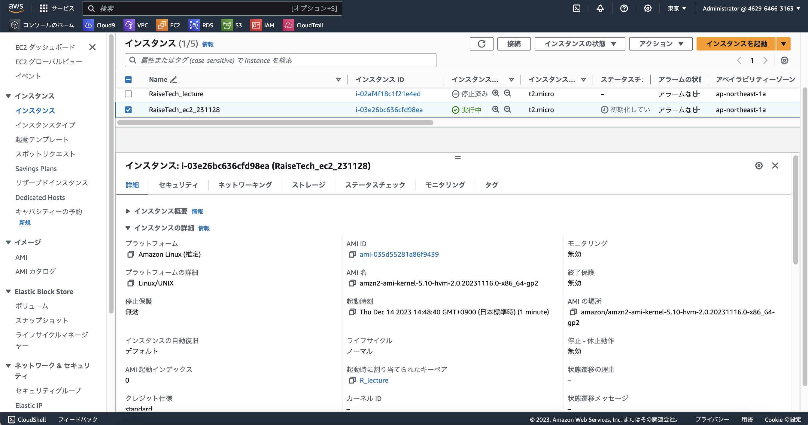  
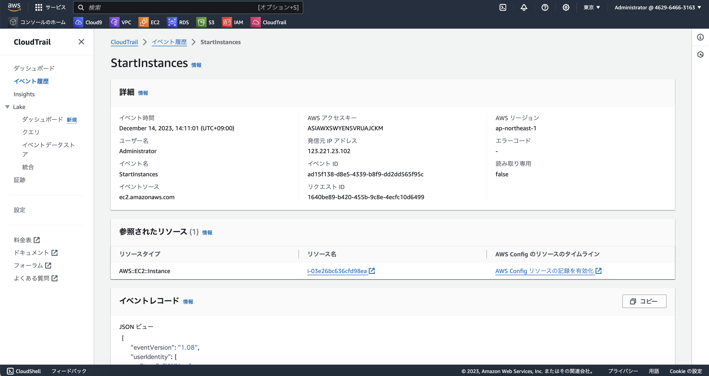  
  
  
## 含まれている内容３つ  

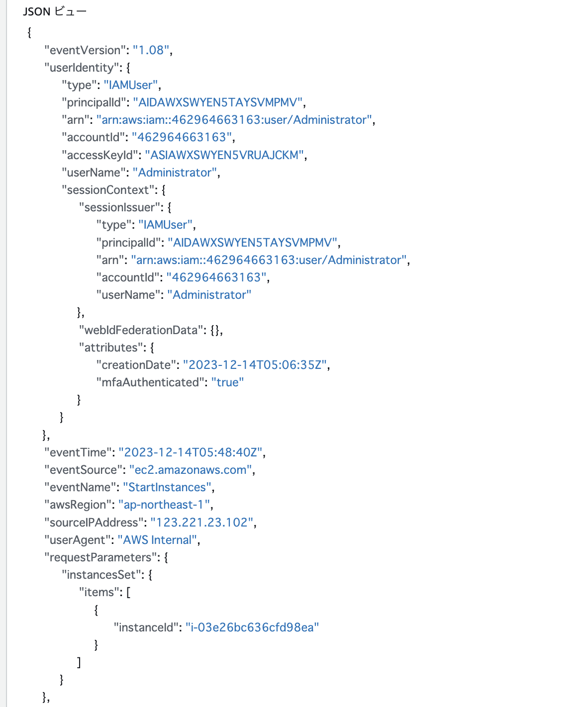  

1. "eventTime": "2023-12-14T05:48:40Z",  
    イベントが行われた時間。  
    9時間時差なので、UTC 05:48:40は、JST(日本標準時)で14:48:40  

2. "eventSource": "ec2.amazonaws.com",  
    リクエストが行われたサービス：EC2  

3. "eventName": "StartInstances",  
    リクエストされたアクション：インスタント起動  

## 学んだことメモ

誰が、いつ、何を操作したかがイベントとして記録されている。

- 誰が：**`userIdentity`、`sourceIPAddress`**  
    リクエストを作成した IAM アイデンティティ、IPアドレス  
    （IPアドレスから、より詳しく特定する情報はプロバイダに開示してもらわないといけないが）  

- いつ：**`eventTime`**  
    リクエストが完了した日付と時刻、協定世界時 (UTC)  
    ※時差注意必要

- 何を：**`eventSource`**、**`eventName`**  
    リクエストが行われたサービス、アクション  

# ALBのアラーム設定

1. Amazon SNS作成  
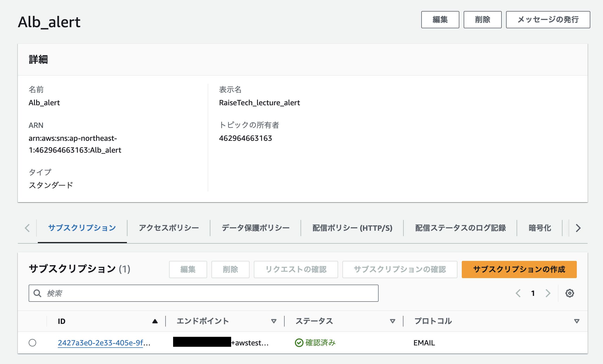  

2. ALBターゲットグループがunhealthyの時にアラートメール通知  
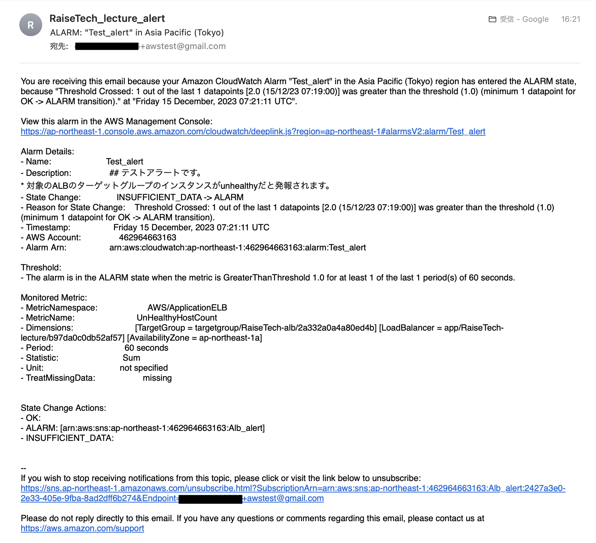  

3. Railsアプリケーションが使える状態にする  
    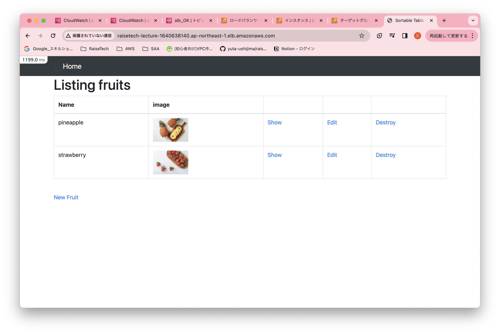  
    ターゲットグループが正常になった状態    
    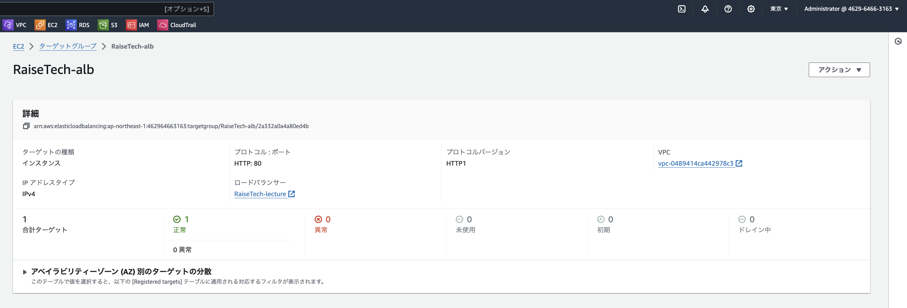  

4. OKアクションの時のメール  
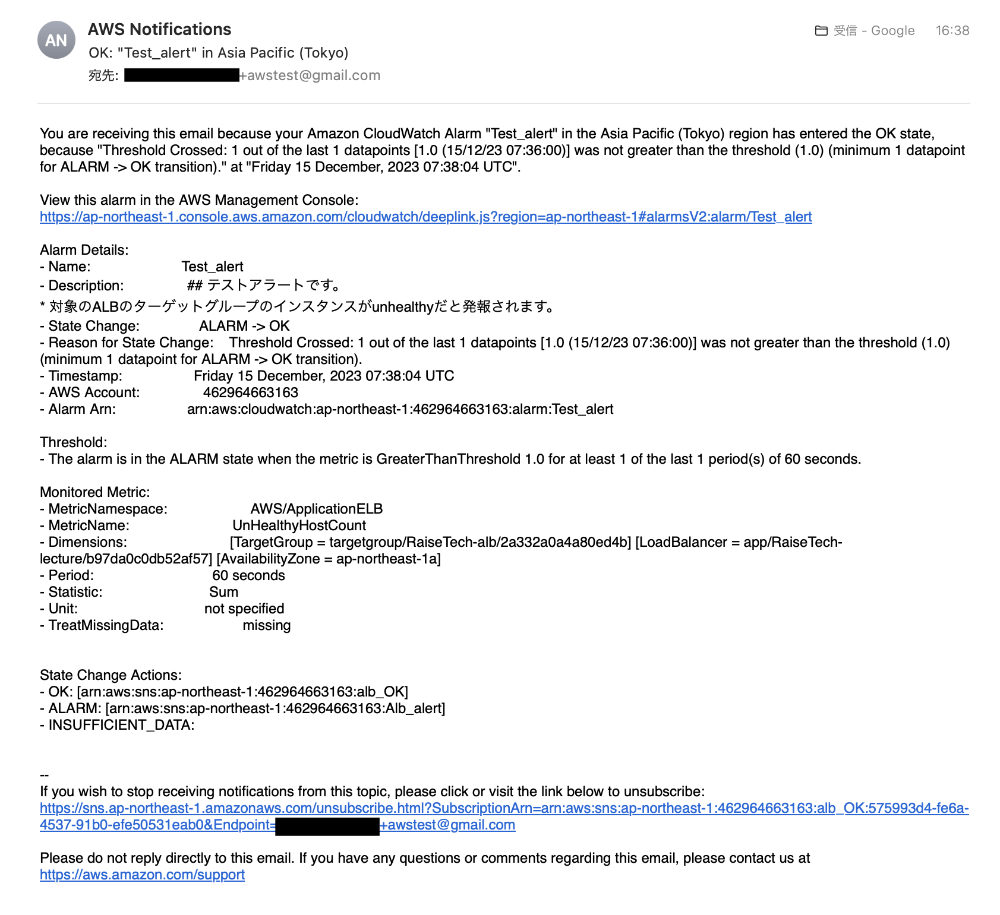  

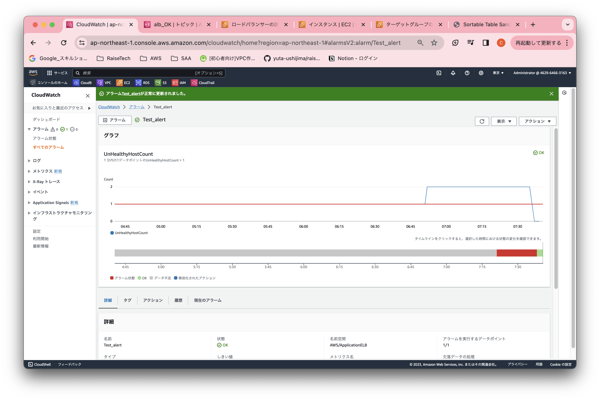  
  

# コスト管理  

## AWS利用料の見積もり  

1. 今日までに作成したリソース内容の見積もり  
[見積もりはこちら](https://calculator.aws/#/estimate?id=437fcaa5fbcc21d65d970cebec9bebbc27afe3e1)  

2. 先月の請求書　billing  
    - 11月
        EC2で税抜で$1.44かかってしまった  
        
        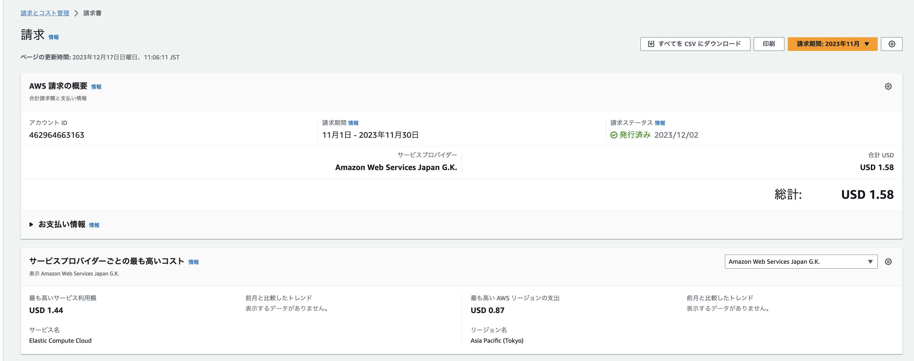  
        
        EC2の明細　　

        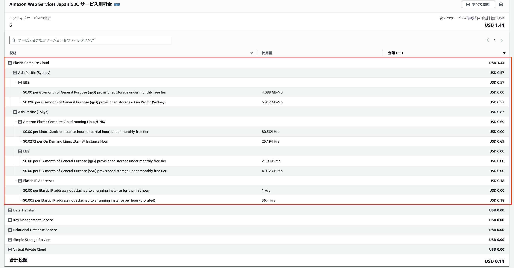  
        コストがかかってしまった要因は下記２点  
        - 初回、リージョンを間違えてシドニーで作成してしまい、無料枠内を超えてしまった  
        - ネットの情報でEC2へのアクセス方法を見て、真似てみた際、当初は使う予定のなかったElastic IPを設定してしまい、無料枠内を越えてしまった  

