# CloudTrail

## 最後にログインしたイベントをピックアップ

- EC2起動  
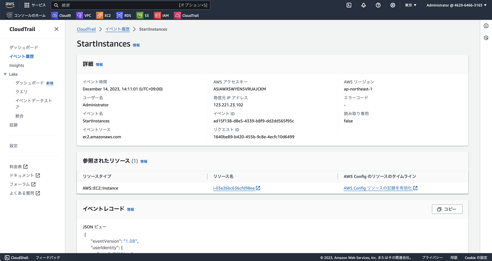    
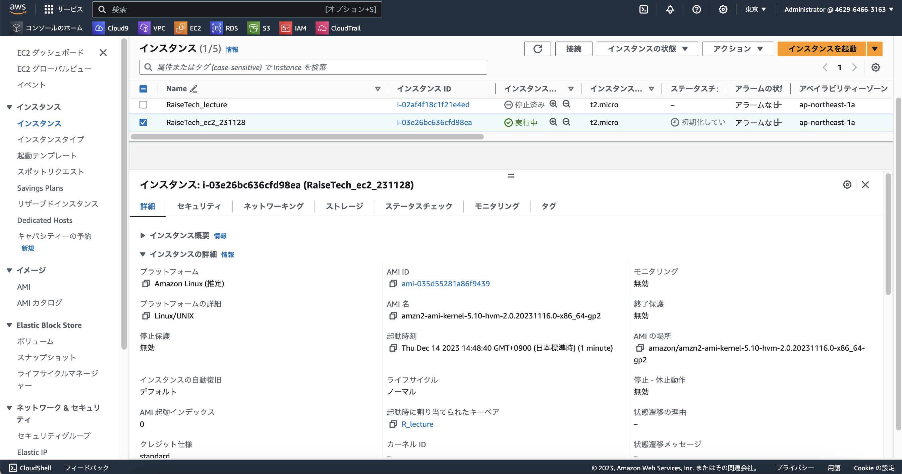    
  
## 見つけたイベントの中に含まれている内容３つ

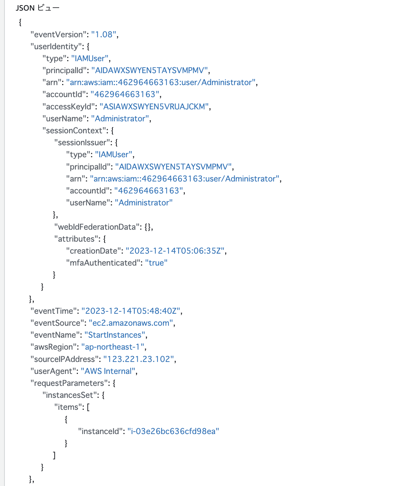  

- "eventTime": "2023-12-14T05:48:40Z",  
    イベントが行われた時間。  
    時差があるため、UTC 05:48:40は、JST(日本標準時)で、14:48:40  
  
- "eventSource": "ec2.amazonaws.com",  
    リクエストが行われたサービス：EC2  
  
- "eventName": "StartInstances",  
    リクエストされたアクション：インスタント起動  
  
## 学んだことメモ

誰が、いつ、何を操作したかがイベントとして記録されている。  

- 誰が：**`userIdentity`、`sourceIPAddress`**
    リクエストを作成した IAM アイデンティティ、IPアドレス  
    （IPアドレスから、より詳しく特定する情報はプロバイダに開示してもらわないといけないが）  

- いつ：**`eventTime`**
    リクエストが完了した日付と時刻、協定世界時 (UTC)
    ※時差注意必要

- 何を：**`eventSource`**、**`eventName`**  
    リクエストが行われたサービス、アクション  

# CloudWatchアラームを使って、ALBのアラームを設定

1. Amazon SNS作成  
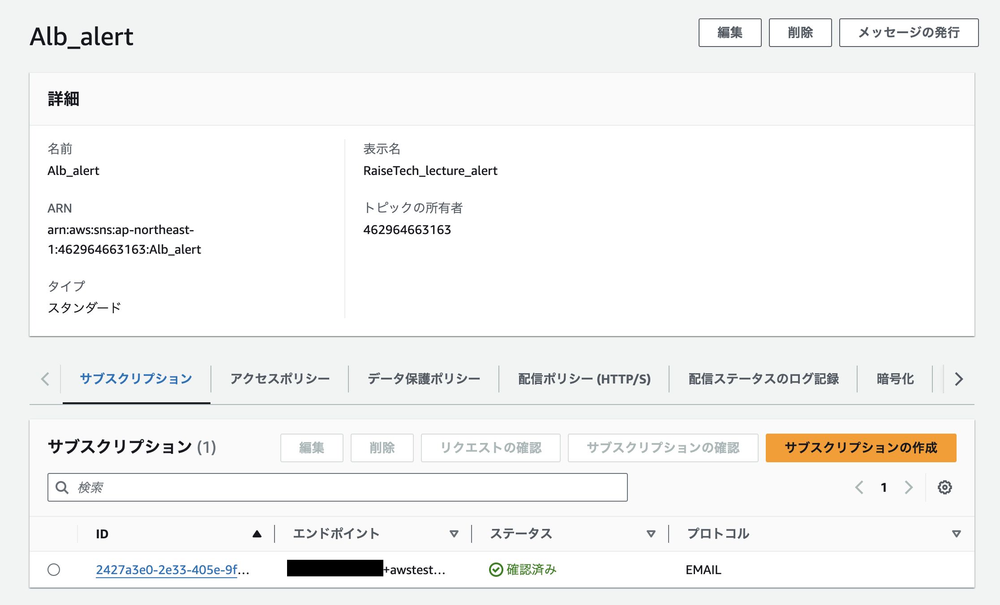  
  
2. EC2のターゲットグループがunhealthyになったらアラート通知  
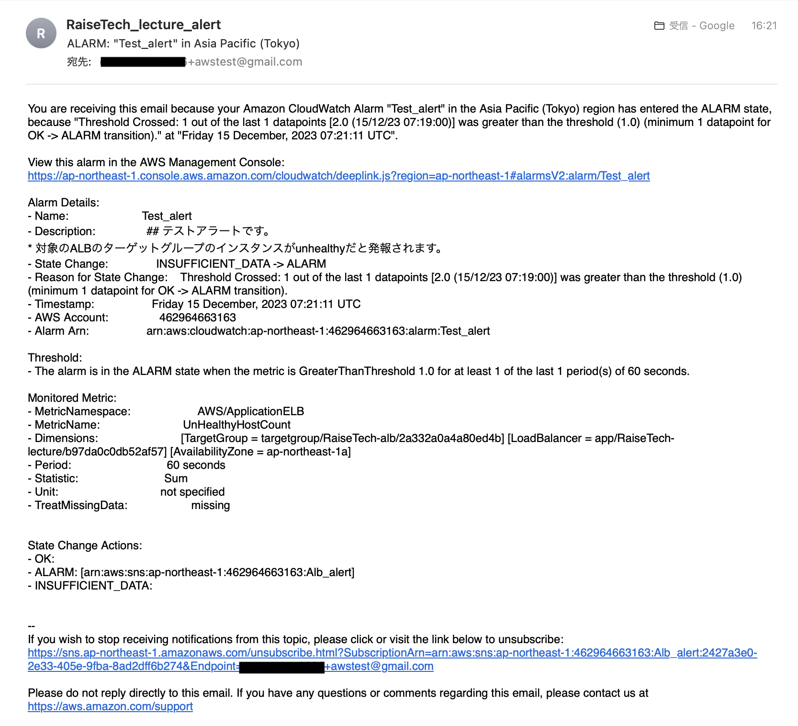  
  
3. Railsアプリケーションに接続　　
    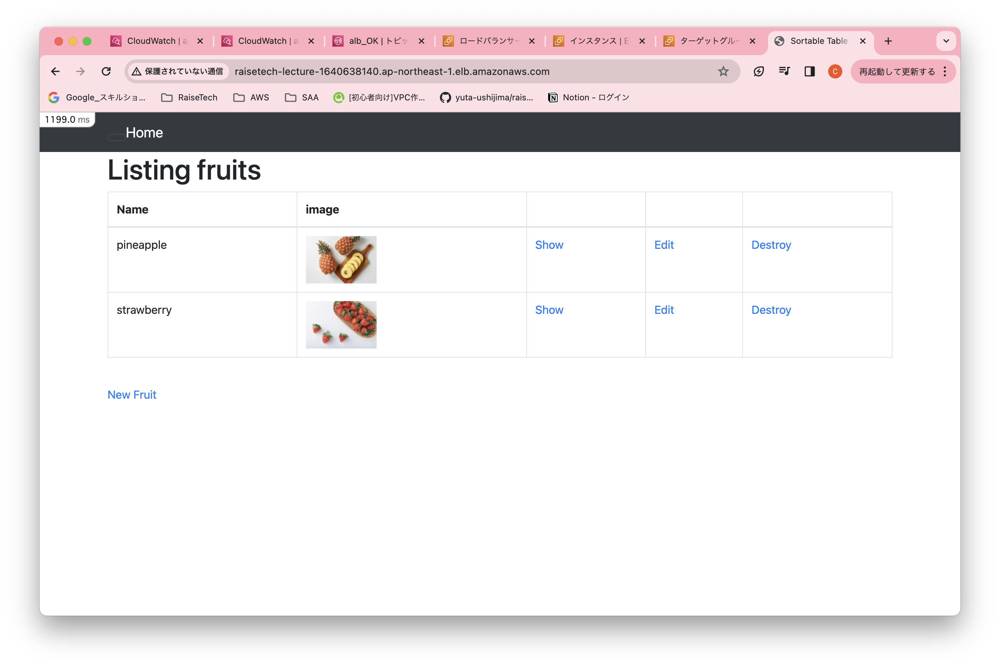  
    　　
    ターゲットグループが正常に変わった　　
    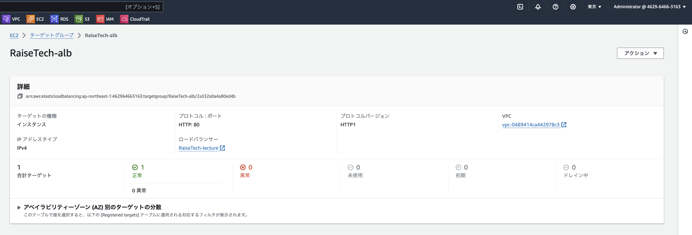
  
4. OKアクションでの通知  
    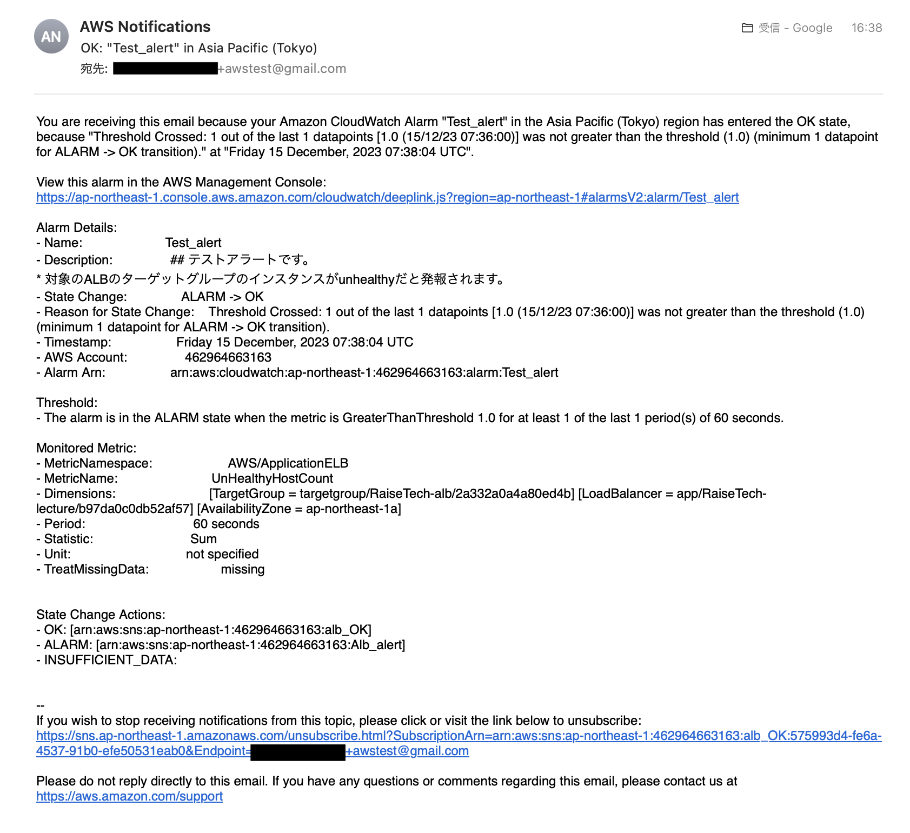  
    グラフ状態  
    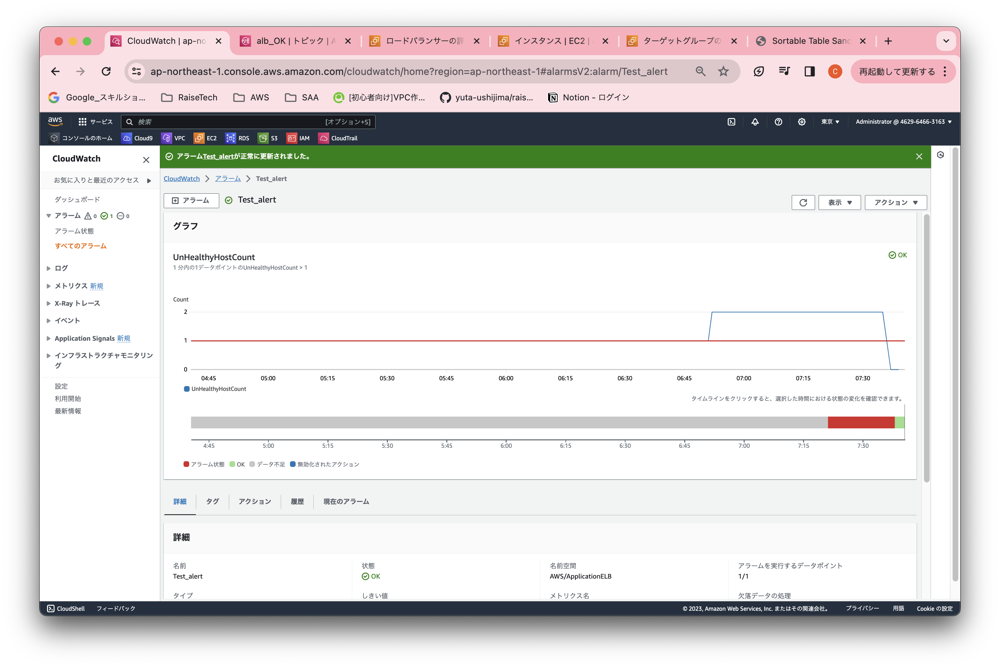  
  
# コスト管理について

## AWS見積もり

[これまで使用した内容のリソースを見積もり作成](https://calculator.aws/#/estimate?id=437fcaa5fbcc21d65d970cebec9bebbc27afe3e1)  

## 先月の請求書確認

- 11月  
    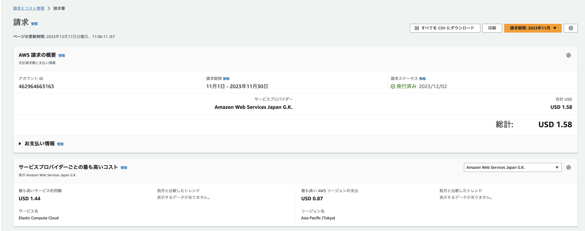  
    EC2で無料枠内越え、$1.44かかってしまった。  

    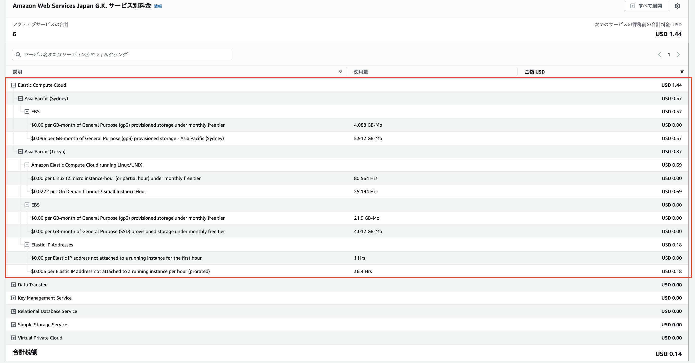  
    - ネットの情報でEC2へのアクセス方法を見て、真似てみた際、本来使う予定のなかったElastic IPを設定してしまい、無料枠内を越えてしまった。  
    - 過去の課題取り組み時、誤ってシドニーのリージョンで作成してしまった。リージョンが変わると、価格帯が違うので注意する。  

