# 第10回課題

## CloudFormation を利用して、現在までに作った環境をコード化

* ３つのyamlファイルに分けてテンプレートを作成  

| テンプレート名 | 作成したリソース |
| - | - |
| Network.yml | VPC IGW サブネット（パブリックサブネット２つ、プライベートサブネット２つ） ルートテーブル |
| SecurityGroup.yml | EC2セキュリティグループ RDSセキュリティグループ ALBセキュリティグループ |
| Application.yml | EC2インスタンス RDS DBサブネットグループ ALB ALBターゲットグループ リスナールール S3バケット IAMロール、ポリシー |

### Network.yml

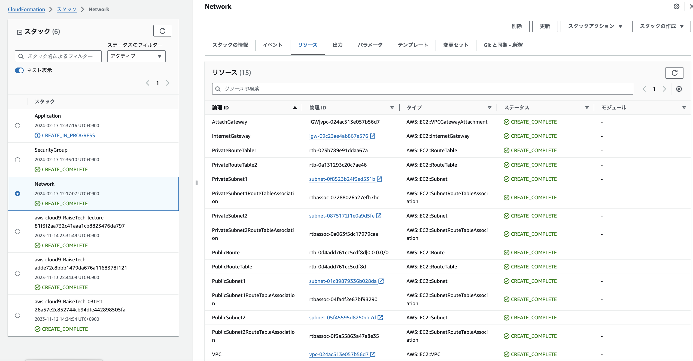 

#### リソース確認　　

- VPC,リソースマップ
    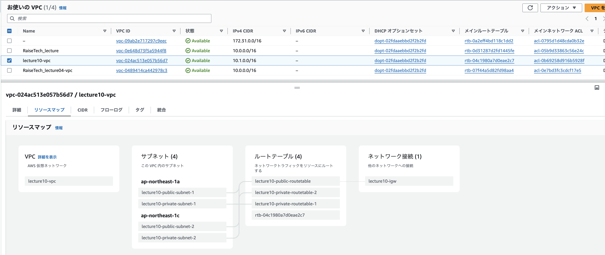 

### SecurityGroup.yml

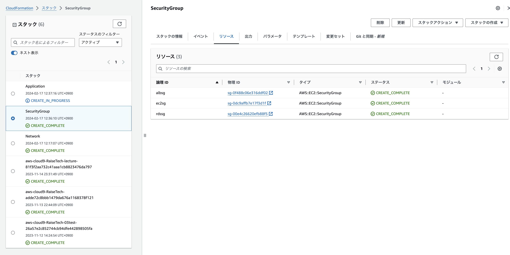

#### リソース確認　　

- EC2セキュリティグループ
    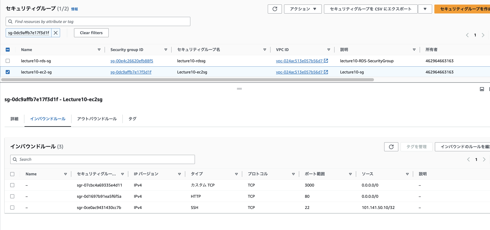

- RDSセキュリティグループ
    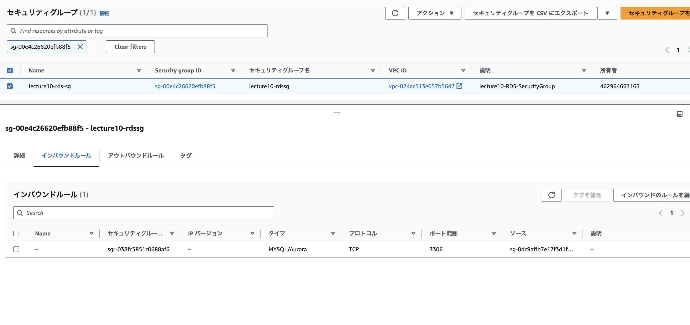

- ALBセキュリティグループ
    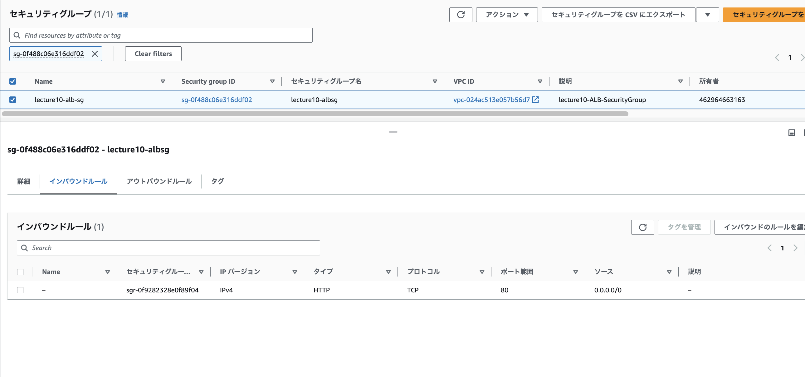

### Application.yml

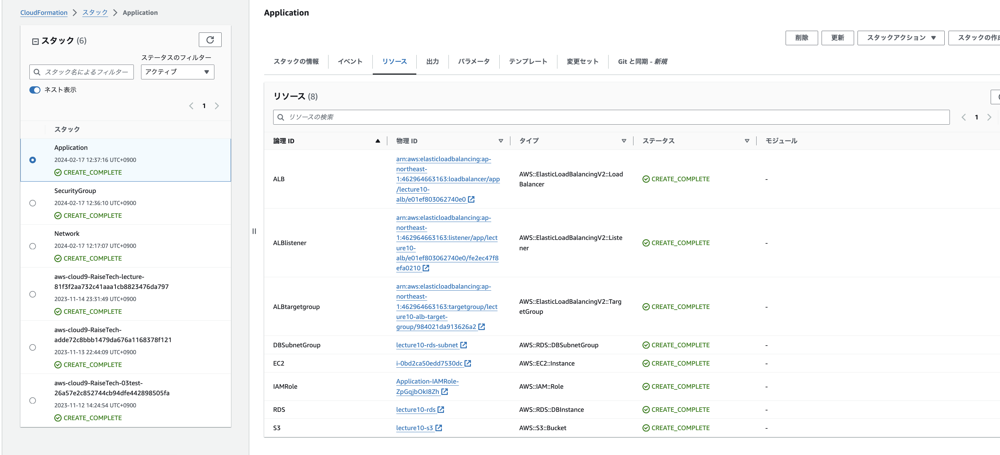

#### リソース確認

- EC2  
    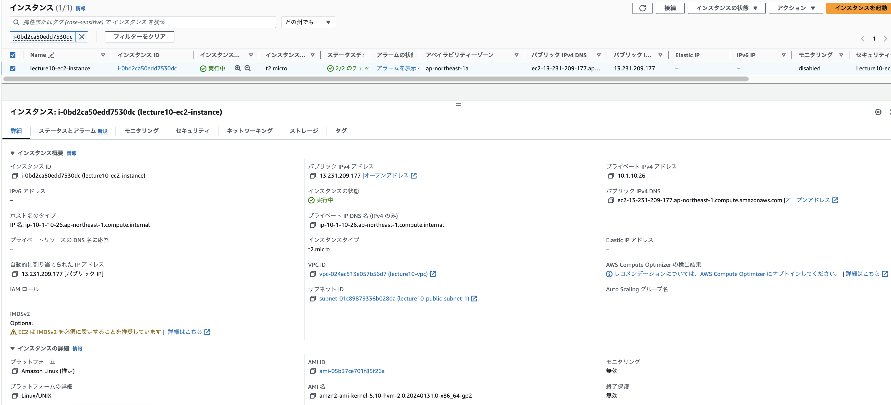

- RDS
    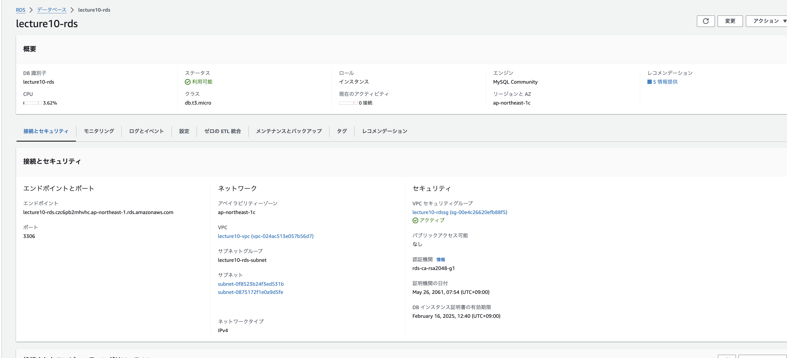

- ALB
    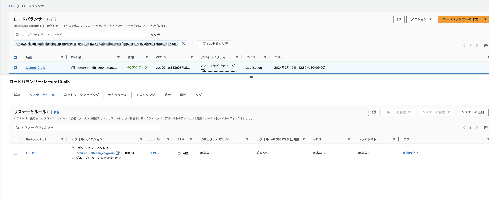

    - ターゲットグループ
        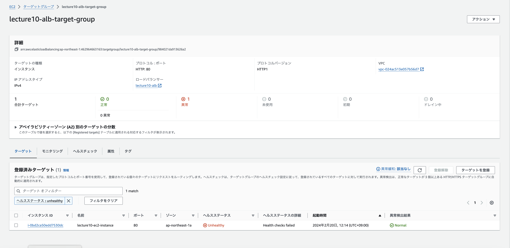

- S3
    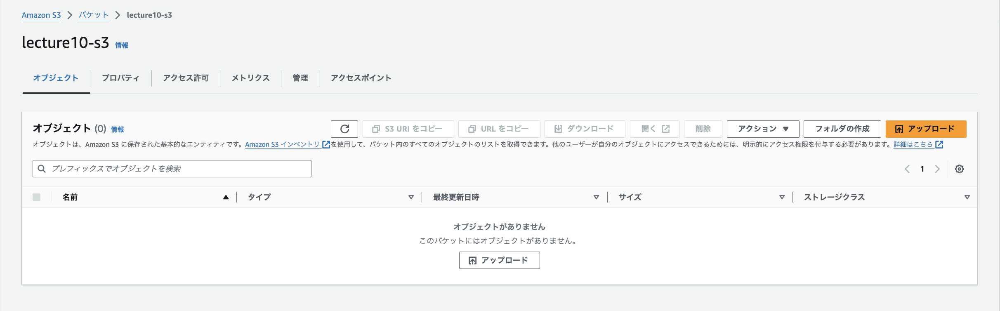

- IAMロール
    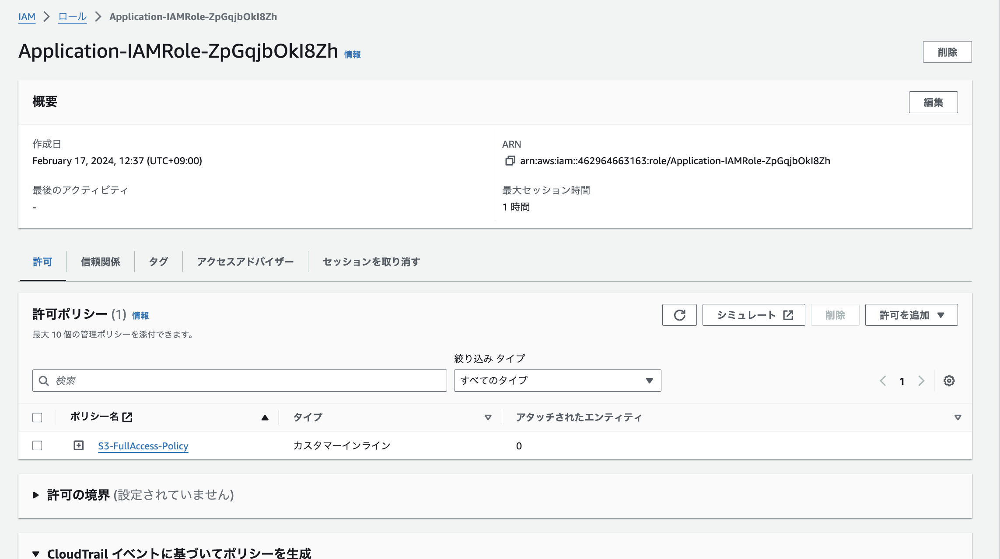

### EC2からRDSへ接続確認

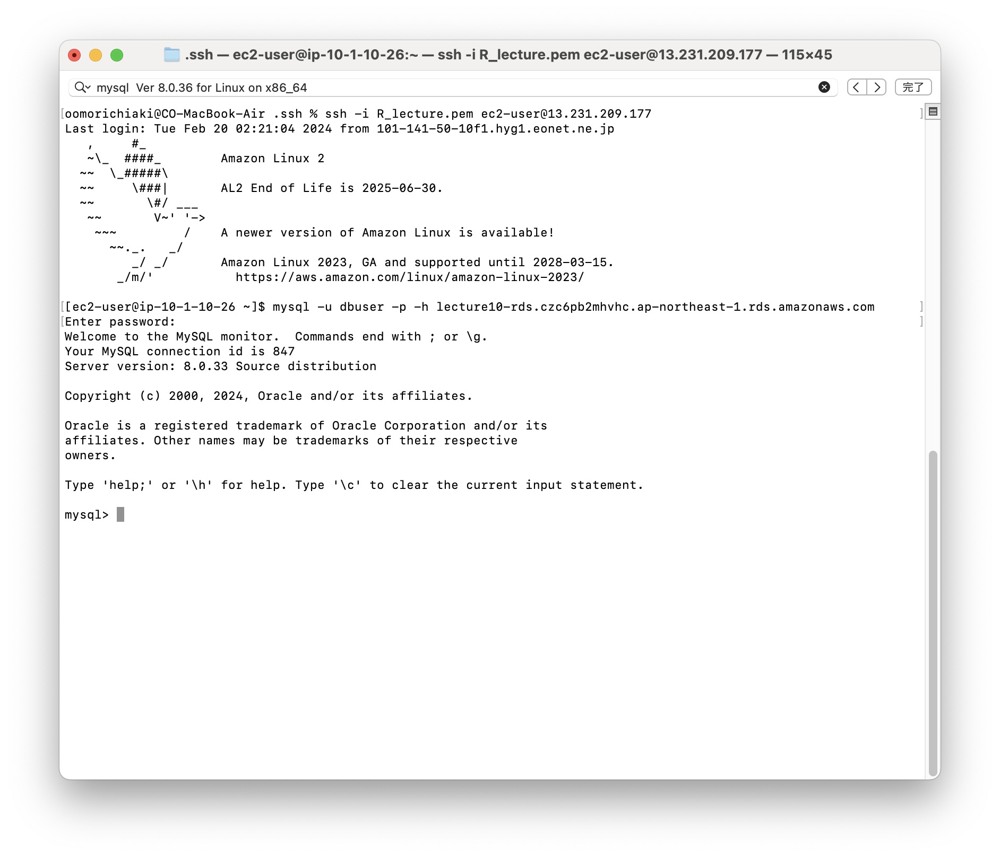

## テンプレート作成時に使用したVScodeの拡張機能

- **indent-rainbow-blocks**  
    インデントの色づけ

- **CloudFormation Snippets**  
    CloudFormationのリソースなど、自動で入力補助してくれる

- **CloudFormation**  
    startと入力するとテンプレートの要素を自動で入力してくれる

- **YAML**  
    yaml言語のサポート

## 学んだこと

* CloudFormationやInfrastructure as Codeについて、何となく苦手意識があり学習が進まなかったが、下記の動画と記事で苦手意識が減った。  
    全体の概要やよくあるミス等を見てから、どこでつまづきやすいのかを把握してから書き始めてみると、比較的導入しやすかった。  
    https://dev.classmethod.jp/articles/the_first_cloudformation/
    
* スペースインデントの数を間違えて、何度もやり直しとなった。  
    VScodeの拡張機能「**indent-rainbow-blocks**」でインデントを色づけすることで階層を把握して、解決した。  

* 論理IDは理解できたが、テンプレートの『Parameters』の意味を理解するのに時間がかかった。  
    下記の記事が参考になった。  
    https://qiita.com/okubot55/items/b18a5dd5166f1ec2696c
